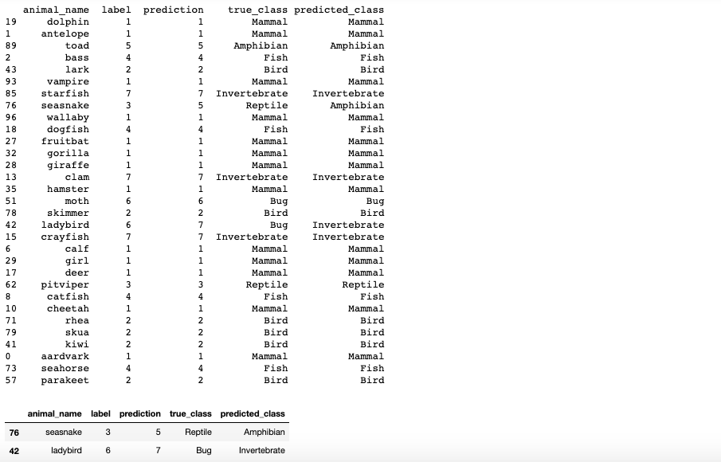

---
jupyter:
  jupytext:
    formats: ipynb,md
    text_representation:
      extension: .md
      format_name: markdown
      format_version: '1.1'
      jupytext_version: 1.2.1
  kernelspec:
    display_name: Python 3
    language: python
    name: python3
---

# Classification Trip to the Animal Kingdom

```python
# This is a code cell without any tag. You can put convenience code here,
# but it won't be included in any way in the final project.
# For example, to be able to run tests locally in the notebook
# you need to install the following:
# pip install nose
# pip install git+https://github.com/datacamp/ipython_nose
# and then load in the ipython_nose extension like this:
%load_ext ipython_nose
```

<!-- #region -->
#### General information about the project    ####
#### All this will be visible on DataCamp.com ####
title          : "Classification Trip to the Animal Kingdom"

description    : > Use Python scikit-learn library to build machine learning models for animal classification. 

long_description: | # Instructor fills out
  *Note: this project is [soft launched](https://en.wikipedia.org/wiki/Soft_launch), which means you may experience bugs. Please click "Report an Issue" in the top-right corner of the project interface to provide feedback.*
  
  In accordance with the Linnaeus method, taxonomists classify the animals, as they do the plants, on the basis of shared physical characteristics. In this project, we are going to learn how to apply Tree-Based Machine Learning Models to classify animals based on various traits. If you are an animal lover and would like to improve you machine learning skills by doing, then this is the project for you!
  
  To complete this project you should be comfortable with supervised learning in Python and machine learning tree-based models. Check out our <a href="https://www.datacamp.com/courses/supervised-learning-with-scikit-learn">Supervised Learning with scikit-learn</a> and <a href="https://www.datacamp.com/courses/machine-learning-with-tree-based-models-in-python">Machine Learning with Tree-Based Models in Python</a> courses to get familiar or brush up on your skills.
  
  The dataset used in this project is <a href="https://www.kaggle.com/uciml/zoo-animal-classification">Kaggle's Zoo Animal Classification Dataset</a>. This dataset describes 101 animals from a zoo. It contains 16 variables with various traits to describe animals of 7 different class types: Mammal, Bird, Reptile, Fish, Amphibian, Bug and Invertebrate.

  

Welcome to the official authoring notebook for your DataCamp project! This notebook, named `project.ipynb`, contains a variety of tagged cells. Tags are in the top left corner of cells. Here's an example of a tag:


These tagged cells are processed by software written by our talented DataCamp engineers and a [DataCamp project](https://www.datacamp.com/projects) is the product.


Before you start working on this notebook, please read the `project.ipynb` notebook format in our [documentation](https://instructor-support.datacamp.com/projects/datacamp-project-jupyter-notebook-format). Each type of tagged cell is described there.

When you first open this notebook, you will find a template for each of the tagged cells for all tasks in your project. Please abide by the content rules there to ensure students have a consistent and smooth learning experience. In addition, the full set of [style guidelines](https://instructor-support.datacamp.com/projects/style-guidelines) will be enforced so please stick to them from the beginning.

Also, please do not leave any of the cells below blank as blank cells break the project build and prevent the project from appearing on datacamp.com.

That's it for now. Happy creating!

*Again, this cell won't be included in the live version of the project because it has no tag.*
<!-- #endregion -->

<!-- #region {"tags": ["type:NotebookTask"]} -->
## 1. The animal classification problem 
<!-- #endregion -->

<!-- #region {"tags": ["@context"]} -->


<!--

-->

Biologists have been naming and classifying organisms for centuries. The practice of classifying organisms is called taxonomy and it allows biologists to group organisms together based on their shared physical characteristics. Classifying organisms also allows biologists to track their evolutionary history and explain how different groups originated. <br>
          
Carl Linnaeus (1707 – 1778) was a Swedish botanist and zoologist who is widely considered to be the "father of modern taxonomy". Currently, about 1.6 million species have been classified within five major categories, or “kingdoms”:

- Plantae (plants)
- Animalia (animals)
- Fungi (toadstools and mushrooms)
- Monera (bacteria and algae)
- Protista (microscopic organisms)

But, it is believed that many millions of species are yet to be classified. Can this laborious process be automated? 

In this notebook, we will try to answer this question focusing on the animal kingdom. We will work with Kaggle's <a href="https://www.kaggle.com/uciml/zoo-animal-classification">Zoo Animal Classification</a> dataset and use tree-based machine learning methods. Let's get started!

For more information on animal classification, you can follow this <a href="https://www.desertusa.com/flora/plant-classified.html#linnaeus#ixzz5vBTa5DgP">link</a>.
<!-- #endregion -->

*Please keep the [soft launch](https://en.wikipedia.org/wiki/Soft_launch) warning and the "reset the project by clicking the circular arrow" note in the next `@instructions` cell. The cell you are currently reading has no tag so it won't be included in the project.*

<!-- #region {"tags": ["@instructions"]} -->
Load "zoo.csv" data into a DataFrame and do an initial exploration.

- Import `pandas` library as `pd` and `matplotlib.pyplot` as `plt`. 
- Read in `datasets/zoo.csv` and assign it to the variable `animals`.
- Print the `shape` of your DataFrame and the types of variables using `animals.dtypes`.
- Use `head()` method to check the first 5 rows of your data.

<hr>

## Good to know

*Note: this project is [soft launched](https://en.wikipedia.org/wiki/Soft_launch), which means you may experience bugs. Please click "Report an Issue" in the top-right corner of the screen to provide feedback.*

This project lets you apply the skills from [Machine Learning with Tree-Based Models in Python](https://www.datacamp.com/courses/machine-learning-with-tree-based-models-in-python). You may also want to refresh the skills taught in its prerequisite course [Supervised Learning with scikit-learn](https://www.datacamp.com/courses/supervised-learning-with-scikit-learn).

Helpful links:


- reading a flat file [exercise](https://campus.datacamp.com/courses/pandas-foundations/data-ingestion-inspection?ex=10)
- pandas.DataFrame [dtypes](https://pandas.pydata.org/pandas-docs/stable/reference/api/pandas.DataFrame.dtypes.html), [shape](https://pandas.pydata.org/pandas-docs/stable/reference/api/pandas.DataFrame.shape.html) and [head](https://pandas.pydata.org/pandas-docs/stable/reference/api/pandas.DataFrame.head.html) documentation

If you experience odd behavior you can reset the project by clicking the circular arrow in the bottom-right corner of the screen. Resetting the project will discard all code you have written so be sure to save it offline first.

Your code should output something like this:


<!-- #endregion -->

<!-- #region {"tags": ["@hint"]} -->
One correct solution looks like this (with some code removed):

```python
import ____ as ____
import ____ as ____

# Read the dataset into animals variable
animals = pd.read_csv(____)

# Check the shape of our DataFrame
print('The shape of the DataFrame is: ',____.shape)

# Check the types of our features
print(____.dtypes)

# Take a look at first rows of data
____.head(____)
```

If you're still stuck, [here](https://gist.github.com/feedthebeat90/d35cdd5a83b471036e30af60ae3caf4e) is the complete code for this solution
<!-- #endregion -->

```python tags=["@sample_code"]
# ... YOUR CODE FOR TASK 1 ...
```

```python tags=["@solution"]
import pandas as pd
import matplotlib.pyplot as plt

# Read the dataset into animals variable
animals = pd.read_csv('datasets/zoo.csv')

# Check the shape of our DataFrame
print('The shape of the DataFrame is: ',animals.shape)

# Check the types of our features
print(animals.dtypes)

# Take a look at first rows of data
animals.head(5)
```

```python tags=["@tests"]
%%nose
# %%nose needs to be included at the beginning of every @tests cell
# David to complete template later. :)

def test_example():
    assert True, "Test nothing for now."
```

<!-- #region {"tags": ["type:NotebookTask"]} -->
## 2. Exploring "zoo" dataset
<!-- #endregion -->

<!-- #region {"tags": ["@context"]} -->


<!--

-->

The DataFrame `animals` contains data on 101 animals from a zoo. There are 15 variables that describe the animals' traits. Almost all variables are numeric-boolean, where "1" means the animal possesses the trait and "0" means that it does not. The only exception is <code>legs</code> which describes the number of legs the animal has. From row-index "3", we can tell that a "bear" is a hairy, 4-legged predator that is neither aquatic nor does it lay eggs. <br> 

In the last column of the DataFrame, animal labels are identified as `class_type`. The seven classes are: Mammal, Bird, Reptile, Fish, Amphibian, Bug, and Invertebrate. Our objective is to predict the animal class label based on their traits. Now let's explore the labels a bit more and tackle our problem!
<!-- #endregion -->

<!-- #region {"tags": ["@instructions"]} -->
Understand the labels of your data and visualize their distribution.

- Define a dictionary in a variable called `class_dict` with the following key-value pairs: 1: 'Mammal', 2: 'Bird', 3: 'Reptile', 4: 'Fish', 5: 'Amphibian', 6: 'Bug', 7: 'Invertebrate'.
- Use the `map()` function and `class_dict` dictionary to turn the integer column `class_type` of `animals` into a readable format. Your result should be stored in `animal_class`.
- Find the distribution of labels using pandas `value_counts()` method on `animal_class`. Store the result in `labels_dist` and print it.
- Use `labels_dist.plot()` to visualize the distribution of labels. Set the `kind` attribute to `'bar'`. 

<hr>

Helpful links:
- pandas.Series [map](https://pandas.pydata.org/pandas-docs/stable/reference/api/pandas.Series.map.html) and [value_counts](https://pandas.pydata.org/pandas-docs/stable/reference/api/pandas.Series.value_counts.html) documentation
- useful [link](https://stackoverflow.com/questions/31029560/plotting-categorical-data-with-pandas-and-matplotlib) with plotting information

Your code should output something like this:


<!-- #endregion -->

<!-- #region {"tags": ["@hint"]} -->
One correct solution looks like this (with some code removed):

```python
# Dictionary for mapping 'class_type' (integer) to 'animal_class' (string) 
class_dict = {____}

# Function to map column of integer labels to string format
animal_class = ____.____.map(____)

# Print distribution of labels and plot it
labels_dist = ____.value_counts()
print(____)
____.plot(____=____)
plt.title('Labels Distribution')
plt.show()
```


If you're still stuck, [here](https://gist.github.com/feedthebeat90/223a95d70dbe3a5bd21c8217769f09c3) is the complete code for this solution
<!-- #endregion -->

```python tags=["@sample_code"]
# ... YOUR CODE FOR TASK 2 ...
```

```python tags=["@solution"]
# Dictionary for mapping 'class_type' (integer) to 'animal_class' (string) 
class_dict = {1: 'Mammal', 2: 'Bird', 3: 'Reptile', 4: 'Fish', 
              5: 'Amphibian', 6: 'Bug', 7: 'Invertebrate'}

# Function to map column of integer labels to string format
animal_class = animals.class_type.map(class_dict)

# Print distribution of labels and plot it
labels_dist = animal_class.value_counts()
print(labels_dist)
labels_dist.plot(kind='bar')
plt.title('Label Distribution')
plt.show()
```

```python tags=["@tests"]
%%nose
# %%nose needs to be included at the beginning of every @tests cell
# David to complete template later. :)

def test_example():
    assert True, "Test nothing for now."
```

<!-- #region {"tags": ["type:NotebookTask"]} -->
## 3. Understanding and setting up the data
<!-- #endregion -->

<!-- #region {"tags": ["@context"]} -->


<!--

-->

In the cell above we visualized the distribution of animal labels by breaking Kingdom Animalia into seven classes. Notice that almost 75% of our data consists of mammals, birds, and fishes.    <br>

Also, note that invertebrates and bugs were split into two groups in our dataset even though a zoologist would say that bugs are a subset of invertebrates. And finally, the reptile and amphibian classes account for less than 10% of the entries.

Fun fact: invertebrates were the first animals to evolve about a billion years ago. These animals are characterized by their lack of a backbone and internal skeletons, as well as their relatively simple anatomy and behavior, at least as compared to most vertebrates. More fun facts can be found <a href="https://www.thoughtco.com/the-six-basic-animal-groups-4096604">here</a>!


Now, let's prepare our data for classification!
<!-- #endregion -->

<!-- #region {"tags": ["@instructions"]} -->
Preprocess data and split it into train and test sets.

- Import `train_test_split` from `sklearn.model_selection`.
- Build a list of strings that contain the names of every column in `animals` DataFrame and store it in a variable named `features`. Make sure 'class_type' header is also included in your list.
- Build a matrix of features `X` and a vector of labels `y` using data stored in `animals` DataFrame.
- Define the variable `SEED` and instantiate it with the number 1.
- Split your data as `X_train`, `X_test`, `y_train`, and `y_test` using `train_test_split`. Use a `test_size` of 0.3 , set `stratify` to `y` and use `SEED` for `random_state`.

<hr>

Helpful links:
- DataCamp [exercise](https://campus.datacamp.com/courses/machine-learning-with-tree-based-models-in-python/the-bias-variance-tradeoff?ex=5) on model instantiation.
- useful [link](https://stackoverflow.com/questions/19482970/get-list-from-pandas-dataframe-column-headers) to retrieve column names from a DataFrame

__There is no expected output for this task.__
<!-- #endregion -->

<!-- #region {"tags": ["@hint"]} -->
One correct solution looks like this (with some code removed):

```python
from ____ import ____

# Build a list of features available in our dataset
features = list(____.columns.values)

# Build a matrix of features and a vector of labels
X = ____[____[____:____]]
y = ____[____[____]]

# Setting a seed for reproducibility of results
SEED = ____

# Split the data into 70% train and 30% test.
X_train, X_test, y_train, y_test = train_test_split(____, ____, 
                                                    ____=____, ____=____, ____=____)
```

If you're still stuck, [here](https://gist.github.com/feedthebeat90/86b99774b53be7027f1412861b4f3ca1) is the complete code for this solution
<!-- #endregion -->

```python tags=["@sample_code"]
# ... YOUR CODE FOR TASK 3 ...
```

```python tags=["@solution"]
from sklearn.model_selection import train_test_split

# Build a list of features available in our dataset
features = list(animals.columns.values)

# Build a matrix of features and a vector of labels
X = animals[features[1:-1]]
y = animals[features[-1]]

# Setting a seed for reproducibility of results
SEED = 1

# Split the data into 70% train and 30% test.
X_train, X_test, y_train, y_test = train_test_split(X, y, test_size=0.3, stratify=y, random_state=SEED)
```

```python tags=["@tests"]
%%nose
# %%nose needs to be included at the beginning of every @tests cell
# David to complete template later. :)

def test_example():
    assert True, "Test nothing for now."
```

<!-- #region {"tags": ["type:NotebookTask"]} -->
## 4. Building our first classifier
<!-- #endregion -->

<!-- #region {"tags": ["@context"]} -->


<!--

-->

In the cell above we prepared our data by constructing a matrix of features and a vector of labels to feed our models. Notice that we dropped the column <code>animal_name</code> because the models we are going to build will only take numeric variables as input. Do not worry, we will recover this column later while exploring our results! Lastly, notice a <code>SEED</code> value was set to 1 in the cell above to ensure reproducibility of results on our project.

Now that we have a good understanding of our data and we have set it up, let's build our first classification tree!
<!-- #endregion -->

<!-- #region {"tags": ["@instructions"]} -->
Build your first classification tree model. 

- Import `DecisionTreeClassifier` from `sklearn.tree` and `accuracy_score` from `sklearn.metrics`.  
- Instantiate a `DecisionTreeClassifier` as `dt` setting its `random_state` to `SEED`. Fit your model using your training set afterwards.
- Use your `dt` model to get predictions using `X_train` and store them in `y_pred_tr`. Proceed likewise with `X_test` and store your predictions in `y_pred_dt`.
- Compute the `accuracy_score` achieved with both the train and test sets and print the results.


<hr>

Helpful links:

- DataCamp [exercise](https://campus.datacamp.com/courses/machine-learning-with-tree-based-models-in-python/classification-and-regression-trees?ex=2) to build a classification tree
- [Scikit-Learn: Decision Trees](https://scikit-learn.org/stable/modules/tree.html#)


Your code should output something like this:


<!-- #endregion -->

<!-- #region {"tags": ["@hint"]} -->
One correct solution looks like this (with some code removed):

```python
from ____ import ____
from ____ import ____

# Instantiate a DecisionTreeClassifier
dt = DecisionTreeClassifier(____=____)
# Train your model
____.fit(____, ____)

# Predict on training and test sets
y_pred_tr = ____.predict(____)
y_pred_dt = ____.predict(____)

# Compute accuracy on training and test sets 
print("Train set accuracy: {:.2f}".format(accuracy_score(____, ____)))
print("Test set accuracy: {:.2f}".format(accuracy_score(____, ____)))
```

If you're still stuck, [here](https://gist.github.com/feedthebeat90/21adf3b30b6e72f89d9ed437defb76ae) is the complete code for this solution
<!-- #endregion -->

```python tags=["@sample_code"]
# ... YOUR CODE FOR TASK 4 ...
```

```python tags=["@solution"]
from sklearn.tree import DecisionTreeClassifier
from sklearn.metrics import accuracy_score

# Instantiate a DecisionTreeClassifier
dt = DecisionTreeClassifier(random_state=SEED)
# Train your model
dt.fit(X_train, y_train)

# Predict on training and test sets
y_pred_tr = dt.predict(X_train)
y_pred_dt = dt.predict(X_test)

# Compute accuracy on training and test sets 
print("Train set accuracy: {:.2f}".format(accuracy_score(y_train, y_pred_tr)))
print("Test set accuracy: {:.2f}".format(accuracy_score(y_test, y_pred_dt)))
```

```python tags=["@tests"]
%%nose
# %%nose needs to be included at the beginning of every @tests cell
# David to complete template later. :)

def test_example():
    assert True, "Test nothing for now."
```

<!-- #region {"tags": ["type:NotebookTask"]} -->
## 5. Tuning our model (Part I)
<!-- #endregion -->

<!-- #region {"tags": ["@context"]} -->


<!--

-->


Wow! We got an outstanding 94% test set accuracy right out of the box! The classification tree seems well suited for our simplified animal classification problem. However, be aware that this will not always be the case when working with less "friendly" datasets on more complex, real-life problems. <br>

Additionally, notice that even though the training set accuracy was 100%, our model did not perform as well on the test set. Why is that? One possible reason is that the classification tree might be overfitting the training data and capturing patterns that are not present in the test set. We can try tuning our model by doing a cross-validated grid search, `GridSearchCV()`, and checking whether the accuracy improved. Let's do it!
<!-- #endregion -->

<!-- #region {"tags": ["@instructions"]} -->
Perform a grid-search cross validation.

- Import `GridSearchCV` from `sklearn.model_selection`.
- Define a variable `params_dt` containing this dictionary: `{'max_depth': [3,4,5,6],'min_samples_leaf': [0.01, 0.05, 0.1], 'min_samples_split': [2, 4, 6], 'criterion': ['gini', 'entropy']}`.
- Instantiate a `GridSearchCV` as `grid_dt` using your parameter grid, `dt` as your estimator and setting `cv` to 3. Also, set `verbose` to 1, `n_jobs` to -1 and choose `'accuracy'` for `scoring`.  
- Fit your model and use `best_estimator_` to store the best classifier in `best_model`.

<hr>

Helpful links:

- DataCamp [exercise](https://campus.datacamp.com/courses/machine-learning-with-tree-based-models-in-python/model-tuning?ex=3) on cross validation
- Scikit-Learn [Grid Search Cross Validation](https://scikit-learn.org/stable/modules/generated/sklearn.model_selection.GridSearchCV.html#) documentation

Your code should output something like this:


<!-- #endregion -->

<!-- #region {"tags": ["@hint"]} -->
One correct solution looks like this (with some code removed):

```python
from ____ import ____

# Define a parameter grid to feed GridSearchCV
params_dt = {____: [____],____: [____], 
             ____: [____], ____: [____]}

# Instantiate a GridSearchCV
grid_dt = GridSearchCV(____=____, ____=____, 
                       ____=____,____=____,____=____,____=____)

# Train the model and extract best estimator
____.fit(____, ____)

# Store your best estimator in best_model
best_model = ____.best_estimator_
```

If you're still stuck, [here](https://gist.github.com/feedthebeat90/99092798a27e32b1d537783c2543aed5) is the complete code for this solution
<!-- #endregion -->

```python tags=["@sample_code"]
# ... YOUR CODE FOR TASK 5 ...
```

```python tags=["@solution"]
from sklearn.model_selection import GridSearchCV

# Define a parameter grid to feed GridSearchCV
params_dt = {'max_depth': [3,4,5,6],'min_samples_leaf': [0.01, 0.05, 0.1], 
             'min_samples_split': [2, 4, 6], 'criterion': ['gini', 'entropy']}

# Instantiate a GridSearchCV
grid_dt = GridSearchCV(estimator=dt, param_grid=params_dt, 
                       scoring='accuracy',cv=3,verbose=1,n_jobs=-1)

# Train the model and extract best estimator
grid_dt.fit(X_train, y_train)

# Store your best estimator in best_model
best_model = grid_dt.best_estimator_
```

```python tags=["@tests"]
%%nose
# %%nose needs to be included at the beginning of every @tests cell
# David to complete template later. :)

def test_example():
    assert True, "Test nothing for now."
```

<!-- #region {"tags": ["type:NotebookTask"]} -->
## 6. Tuning our model (Part II)
<!-- #endregion -->

<!-- #region {"tags": ["@context"]} -->


<!--

-->


Good job! We have just performed a grid search cross validation on our data and found a best model. Moving forward, we can make predictions with the best model configuration found above. 

Will we be able to get any improvement on accuracy after model tuning?
<!-- #endregion -->

<!-- #region {"tags": ["@instructions"]} -->
Check the results of your grid-search cross validation.

- Print the parameters of your tuned model using `grid_dt.best_params_`. 
- Get predictions with your `best_model` using `predict()` method and `X_test` . Store them on `y_pred_gs`.
- Compute the accuracy of your predictions using `accuracy_score` function and stored them in a variable `acc`.
- Print the results stored in `acc`.

<hr>

Helpful links:
- DataCamp [exercise](https://campus.datacamp.com/courses/machine-learning-with-tree-based-models-in-python/classification-and-regression-trees?ex=3) on model evaluation
- Scikit-Learn [Grid Search Cross Validation](https://scikit-learn.org/stable/modules/generated/sklearn.model_selection.GridSearchCV.html#) documentation

Your code should output something like this:


<!-- #endregion -->

<!-- #region {"tags": ["@hint"]} -->
One correct solution looks like this (with some code removed):

```python
# Check best parameters
print(____.best_params_)

# Compute test set predictions
y_pred_gs = ____.predict(____)

# Compute test set cccuracy
acc = accuracy_score(____, ____)

# Print results
print('Test set accuracy of GridSearchCV: {:.2f}'.format(____))

```

If you're still stuck, [here](https://gist.github.com/feedthebeat90/67192600b5acad55d0cba8c074f7d1d8) is the complete code for this solution
<!-- #endregion -->

```python tags=["@sample_code"]
# ... YOUR CODE FOR TASK 6 ...
```

```python tags=["@solution"]
# Check best parameters
print(grid_dt.best_params_)

# Compute test set predictions
y_pred_gs = best_model.predict(X_test)

# Compute test set cccuracy
acc = accuracy_score(y_test, y_pred_gs)

# Print results
print('Test set accuracy of GridSearchCV: {:.2f}'.format(acc))
```

```python tags=["@tests"]
%%nose
# %%nose needs to be included at the beginning of every @tests cell
# David to complete template later. :)

def test_example():
    assert True, "Test nothing for now."
```

<!-- #region {"tags": ["type:NotebookTask"]} -->
## 7. Comparing results with a linear model
<!-- #endregion -->

<!-- #region {"tags": ["@context"]} -->


<!--

-->

Oops! It seems like after fitting more than 200 different model configurations on our grid search, we are not getting accuracy improvements!  

It might be the case that there are limitations with this model and that it is unable to predict with greater accuracy. Or, maybe the data we are using has limitations we do not know about. We might even be experiencing a combination of both problems!

In order to keep exploring our question, let's fit a logistic regression model and compare it to the best decision tree model.
<!-- #endregion -->

<!-- #region {"tags": ["@instructions"]} -->
Build a logistic regression model to compare results.

- Import `LogisticRegression` module from `sklearn.linear_model`.
- Instantiate a `LogisticRegression` classifier as `lr` setting its `random_state` to `SEED` and `max_iter` to 1500. Additionally, choose 'lbfgs' as your `solver` and set `multi_class` to 'multinomial'.
- Use `.fit()` on your model, `lr`, with the training data.
- Compute and print the accuracy using `lr.score()` method for both the train and test sets.

<hr>

Helpful links:
- DataCamp [lesson](https://campus.datacamp.com/courses/linear-classifiers-in-python/applying-logistic-regression-and-svm?ex=5) on Logistic Regression
- Scikit-Learn [Logistic Regression](https://scikit-learn.org/stable/modules/generated/sklearn.linear_model.LogisticRegression.html) documentation

Your code should output something like this:


<!-- #endregion -->

<!-- #region {"tags": ["@hint"]} -->
One correct solution looks like this (with some code removed):

```python
# Import linear Logistic Regression classifier 
from ____ import ____

# Instantiate a Logistic Regression model
lr = LogisticRegression(____=____, ____=____, 
                        ____=____, ____=____)

# Fit model to the training set
____.fit(____, ____)

# Print train and test set accuracy
print("Train set accuracy: {:.2f}".format(lr.score(____, ____)))
print("Test set accuracy: {:.2f}".format(lr.score(____, ____)))
```

If you're still stuck, [here](https://gist.github.com/feedthebeat90/af42f10da796d6eac0dd46ad87e0d36e) is the complete code for this solution
<!-- #endregion -->

```python tags=["@sample_code"]
# ... YOUR CODE FOR TASK 7 ...
```

```python tags=["@solution"]
# Import linear Logistic Regression classifier 
from sklearn.linear_model import LogisticRegression

# Instantiate a Logistic Regression model
lr = LogisticRegression(random_state=SEED, solver='lbfgs', 
                        max_iter= 1500, multi_class='multinomial')

# Fit model to the training set
lr.fit(X_train, y_train)

# Print train and test set accuracy
print("Train set accuracy: {:.2f}".format(lr.score(X_train, y_train)))
print("Test set accuracy: {:.2f}".format(lr.score(X_test, y_test)))
```

```python tags=["@tests"]
%%nose
# %%nose needs to be included at the beginning of every @tests cell
# David to complete template later. :)

def test_example():
    assert True, "Test nothing for now."
```

<!-- #region {"tags": ["type:NotebookTask"]} -->
## 8. Trying a more complex tree-based model
<!-- #endregion -->

<!-- #region {"tags": ["@context"]} -->


<!--

-->

From the cell above, it seems like the linear logistic regression model outperforms the base decision tree model. So, our next question might be: is it possible to build a more complex tree based model that can match or outperform the logistic regression model? <br> 
          <br> For this purpose, we can build a random forest model and compare its performance to our previous models!
<!-- #endregion -->

<!-- #region {"tags": ["@instructions"]} -->
Build a random forest classifier and check whether it outperforms your previous models. 

- Instantiate a `RandomForestClassifier` as `rf` setting its `random_state` to `SEED` and `n_estimators` to 25. 
- Fit your model using your training set.
- Use your test set to get predictions and stored them in `y_pred_rf`.
- Compute the `accuracy_score` achieved with on your test set.

<hr>

Helpful links:
- DataCamp [lesson](https://campus.datacamp.com/courses/machine-learning-with-tree-based-models-in-python/bagging-and-random-forests?ex=7) on Random Forests
- Scikit-Learn [Random Forest](https://scikit-learn.org/stable/modules/generated/sklearn.ensemble.RandomForestClassifier.html) documentation


Your code should output something like this:


<!-- #endregion -->

<!-- #region {"tags": ["@hint"]} -->
One correct solution looks like this (with some code removed):

```python
from ____ import ____

# Instantiate a Random Forest Classifier
rf = RandomForestClassifier(____=____, ____=____)
            
# Train your model   
____.fit(____, ____) 

# Predict test set labels
y_pred_rf = ____.predict(____)

# Print test set accuracy
print('Test set accuracy: {:.2f}'.format(accuracy_score(____, ____)))
```

If you're still stuck, [here](https://gist.github.com/feedthebeat90/7e7ea5db28164d306167e9b6e5ab9702) is the complete code for this solution
<!-- #endregion -->

```python tags=["@sample_code"]
# ... YOUR CODE FOR TASK 8 ...
```

```python tags=["@solution"]
from sklearn.ensemble import RandomForestClassifier

# Instantiate a Random Forest Classifier
rf = RandomForestClassifier(n_estimators=25, random_state=SEED)
            
# Train your model   
rf.fit(X_train, y_train) 

# Predict test set labels
y_pred_rf = rf.predict(X_test)

# Print test set accuracy
print('Test set accuracy: {:.2f}'.format(accuracy_score(y_test, y_pred_rf)))
```

```python tags=["@tests"]
%%nose
# %%nose needs to be included at the beginning of every @tests cell
# David to complete template later. :)

def test_example():
    assert True, "Test nothing for now."
```

<!-- #region {"tags": ["type:NotebookTask"]} -->
## 9. Checking the importance of features
<!-- #endregion -->

<!-- #region {"tags": ["@context"]} -->


<!--

-->

The random forest classifier scored 97% accuracy and matched the logistic regression model! 

Now that we have our random forest model, let's take a look at the importance of features. This way we can learn which features are the most relevant variables in our model when trying to classify an animal.

One thing we should know is that selecting features for building a model requires some expert knowledge about the area of study. Therefore, one cool exercise we can do before moving forward is to think about the following: which five features would zoologists value the most if they had to classify different kinds of animals?


<!-- #endregion -->

<!-- #region {"tags": ["@instructions"]} -->
Use your random forest classifier to check the importance of features. 

- Store a `pd.Series` object on a variable named `importances`. Use `rf.feature_importances_` as `data` and set the `index` to `X_train.columns`.
- Sort `importances` using `sort_values()` method and store them in `sorted_importances` variable.
- Use `plot()` method to visualize the values stored in `sorted_importances`. Make your barplot horizontal setting `kind` to `'barh'` and choose your `color` to be `'lightgreen'`.

<hr>

Helpful links:
- Visualizing features importances [exercise](https://campus.datacamp.com/courses/machine-learning-with-tree-based-models-in-python/bagging-and-random-forests?ex=10) on DataCamp
- Scikit-Learn [Random Forest](https://scikit-learn.org/stable/modules/generated/sklearn.ensemble.RandomForestClassifier.html#sklearn.ensemble.RandomForestClassifier.feature_importances_) documentation

Your code should output something like this:


<!-- #endregion -->

<!-- #region {"tags": ["@hint"]} -->
One correct solution looks like this (with some code removed):

```python
# Create a pd.Series with the importance of features
importances = pd.Series(____=____.feature_importances_,
                        ____=____.columns)

# Sort importances before plotting
sorted_importances = ____.sort_values()

# Draw a horizontal barplot of importances_sorted
____.plot(____=____, ____=____)
plt.title('Features Importances')
plt.show()
```
If you're still stuck, [here](https://gist.github.com/feedthebeat90/f3ffaca054709099cca6e44d4b068726) is the complete code for this solution
<!-- #endregion -->

```python tags=["@sample_code"]
# ... YOUR CODE FOR TASK 9 ...
```

```python tags=["@solution"]
# Create a pd.Series with the importance of features
importances = pd.Series(data=rf.feature_importances_,
                        index= X_train.columns)

# Sort importances before plotting
sorted_importances = importances.sort_values()

# Draw a horizontal barplot of importances_sorted
sorted_importances.plot(kind='barh', color='lightgreen')
plt.title('Features Importances')
plt.show()
```

```python tags=["@tests"]
%%nose
# %%nose needs to be included at the beginning of every @tests cell
# David to complete template later. :)

def test_example():
    assert True, "Test nothing for now."
```

<!-- #region {"tags": ["type:NotebookTask"]} -->
## 10. Analyzing results
<!-- #endregion -->

<!-- #region {"tags": ["@context"]} -->


<!--

-->

Excellent job! Knowing whether the animal has `feathers`, if it can produce `milk`, or knowing how many `legs` it has, is particularly important for our model to make correct predictions. On the other hand, whether the animal is `domestic` or a `predator` does not seem to add much information to help solve our classification problem. <br> 

So far, we have tried different models types and increased model complexity in order to obtain a better accuracy metric. However, we have not looked at our results carefully yet! <br> <br>
In the final part of our project, we are going to dive into our models' predictions to determine which animals might be difficult to predict. Do our models have limitations? Is the data good enough to solve our problem? Let's find out!

<!-- #endregion -->

<!-- #region {"tags": ["@instructions"]} -->
Analyze your results with a pre-defined function. 

- Import `support` module from `datasets`.
- Use the `support.get_results()` method using `y_test`, `y_pred_dt`, `animals`, and `class_dict` as input arguments. Store the resulting DataFrame in the variable `results`. 
- Print the object stored in `results` and read it carefully.
- Identify wrong predictions in `results` using the inequality `results['label'] != results['prediction']`. 

<hr>

Helpful links:
- useful [post](https://stackoverflow.com/questions/21800169/python-pandas-get-index-of-rows-which-column-matches-certain-value) on DataFrame indexing.

Your code should output something like this:


<!-- #endregion -->

<!-- #region {"tags": ["@hint"]} -->
One correct solution looks like this (with some code removed):

```python
from ____ import ____

# Use get_results function with predictions from Decision Tree Model
results = support.get_results(____, ____, ____, ____)

# Print the DataFrame stored in results
print(____)

# Identify animals where our model made mistakes
____[____[____] != ____[____]]
```

If you're still stuck, [here](https://gist.github.com/feedthebeat90/c901f74c774e483ef523f9f7cb8e9d9c) is the complete code for this solution
<!-- #endregion -->

```python tags=["@sample_code"]
# ... YOUR CODE FOR TASK 10 ...
```

```python tags=["@solution"]
from datasets import support

# Use get_results function with predictions from Decision Tree Model
results = support.get_results(y_test, y_pred_dt, animals, class_dict)

# Print the DataFrame stored in results
print(results)

# Identify animals where our model made mistakes
results[results['label'] != results['prediction']]
```

```python tags=["@tests"]
%%nose
# %%nose needs to be included at the beginning of every @tests cell
# David to complete template later. :)

def test_example():
    assert True, "Test nothing for now."
```

<!-- #region {"tags": ["type:NotebookTask"]} -->
## Data limitations and conclusions
<!-- #endregion -->

<!-- #region {"tags": ["@context"]} -->


<!--

-->

The decision tree mistakenly classified 2 out of 31 animals in the test set. The "seasnake", a `Reptile`, was predicted to be an `Amphibian`. The "ladybird", a `Bug`, was predicted to be an `Invertebrate`. Notice how those misclassifications belong to labels that are less frequent in the label distribution graph from Task 2. Also, zoologists group bugs and invertebrates together, so expect some difficulties in distinguishing these two classes.

From our analysis, we can intuit that the ability of our model to accurately predict an animal's class based on its traits depends not only on the complexity of the model but also on the quantity and quality of the training data! 

Lastly, we should note that choosing 'accuracy' as a metric for our models might not have been the best choice given the distribution of labels in our dataset was "skewed". Other metric choices such as recall, precision or F1 score could have yielded better results, but this is outside the scope of our analysis.
<!-- #endregion -->

<!-- #region {"tags": ["@instructions"]} -->
- According to the analysis of results, is it `True` or `False` that the 'dolphin' was correctly classified? 

<hr>

Congratulations on reaching the end of the project! If you have not tried it already, you should check your project now by clicking the "Check Project" button.

Good luck! :]


If you'd like to continue building your Python skills, all of DataCamp's Python courses are listed [here](https://www.datacamp.com/courses/tech:python).

__There is no expected output for this task.__
<!-- #endregion -->

<!-- #region {"tags": ["@hint"]} -->
One correct solution looks like this (with some code removed):

```python
# According to the analysis of results: 
the_dolphin_was_correctly_classified = ____
```

If you're still stuck, [here](https://gist.github.com/feedthebeat90/4ab1dd862a8b7a33b61a966f4d71c70c) is the complete code for this solution
<!-- #endregion -->

```python tags=["@sample_code"]
# According to the analysis of results: 
the_dolphin_was_correctly_classified = False
```

```python tags=["@solution"]
# According to the analysis of results: 
the_dolphin_was_correctly_classified = True
```

```python tags=["@tests"]
%%nose
# %%nose needs to be included at the beginning of every @tests cell
# David to complete template later. :)

def test_example():
    assert True, "Test nothing for now."
```

*The recommended number of tasks in a DataCamp project is between 8 and 10, so feel free to add more if necessary. You can't have more than 12 tasks.*

*We need a full suite of tagged cells (i.e. @context, @instructions, etc.) for all tasks with the exact correct tagging, otherwise, the project won't build and won't show up on datacamp.com. To ensure this, copy and paste the the cells above to make more tasks as done in [this screenshare](https://www.useloom.com/share/fe2b7da288454cd18f8a7a606d32eecf).*
